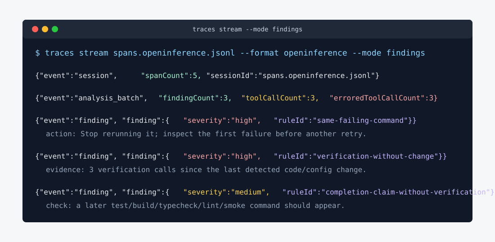

# traces

> Point `traces` at any agent trace — OTLP spans your own system emits, or the session logs Claude Code, Codex, OpenCode and Gemini already write to disk. Get failure-mode and efficiency findings, plus a straight answer about what the trace cannot tell you. A CLI *and* an SDK.


[](https://www.npmjs.com/package/@tangle-network/traces)
[](./LICENSE)
[](https://nodejs.org)

It reads a run as spans and reports where the agent got stuck, burned tokens, or stopped checking its own work. The deterministic pass runs locally, with no API key and no cost.

There are two ways in, and they are not equal:

| | Use when | How |
|---|---|---|
| **Emit the contract** | You control the system | Emit [`@tangle-network/agent-trace-contract`](https://github.com/tangle-network/agent-sdk/tree/main/packages/agent-trace-contract) spans, then `traces analyze --otlp <file\|dir>` |
| **Adapters** | You do *not* control the format | `traces analyze --harness claude-code` reads a proprietary session store and translates it |

Emitting the contract is the supported way to integrate a new system. The adapters are the legacy edge — they exist because the coding agents write formats nobody standardised, and each one is a translation somebody has to maintain. If you can choose, choose `--otlp`.

## Contents

- [Install](#install)
- [Quick start](#quick-start)
- [Integrate your own system](#integrate-your-own-system)
- [What it finds](#what-it-finds)
- [Supported harnesses](#supported-harnesses)
- [CLI reference](#cli-reference)
- [Live stream](#live-stream)
- [Watch a run tree](#watch-a-run-tree)
- [Improvement engine](#improvement-engine)
- [Session index](#session-index)
- [Session bundle](#session-bundle) · [Two views](#two-views-two-consumers)
- [Policy-mining evidence](#policy-mining-evidence)
- [Upload to the Intelligence Platform](#upload-to-the-intelligence-platform)
- [Trace analysts](#trace-analysts)
- [Agent skills](#agent-skills)
- [Library (SDK)](#library-sdk)
- [Examples](#examples)
- [Develop](#develop)

## Install

```bash
curl -fsSL https://raw.githubusercontent.com/tangle-network/traces/main/install.sh | bash
traces --version

npx --yes @tangle-network/traces@latest analyze --harness claude-code --last 1  # run without installing
npm i -g @tangle-network/traces                                           # install manually
npm i @tangle-network/traces                                              # use it as a library
```

Requires Node ≥ 22.

## Quick start

```bash
traces validate spans.otlp.jsonl                  # what can this trace answer?
traces analyze  --otlp spans.otlp.jsonl           # analyse it, no adapter involved
traces analyze --harness claude-code --last 1     # or read a coding agent's own log
traces improve --harness claude-code --last 5 --dir .traces/improvement
traces watch --all
traces stream --all --mode findings
```

The first command is shown in the demo above.
The **deterministic pass** checks stuck loops, token growth, output decay, missing self-verification, tool failures, and human corrections.
Each supported issue is returned as a finding with evidence, an action, confidence, and a validation plan.
It needs no API key and costs nothing.

Add `--llm` for the **agentic analysts**. `traces` first uses free local signals to choose the smallest useful set: a failure review always runs, while knowledge and edit reviews run only when failures, repeated calls, or corrective feedback support them. They call OpenAI and respect `--budget <usd>`.

Every run also writes a **canonical OpenInference JSONL artifact**.
Use it with [HALO](https://github.com/context-labs/halo), [Hodoscope](https://github.com/ManifoldRG/hodoscope), or any command that reads the file.
See [Trace analysts](#trace-analysts).

`traces improve` is the reviewable action path.
It writes one typed result, one report, flattened evidence rows, and the canonical OTLP trace.
Each finding already contains the claim, evidence, recommended action, confidence, and validation plan.

## Integrate your own system

No adapter, no plugin. Emit the span contract and point `--otlp` at the file.

```bash
npm i @tangle-network/agent-trace-contract    # zero runtime dependencies
```

You install it to PRODUCE spans. This package already depends on it to read
them, so `npx @tangle-network/traces@latest` arrives with the contract-backed
analyses working: trace conformance, `traces validate`, `--otlp` inbound
reading, round-over-round convergence and the steering chain, and OpenInference
/ intelligence-spans conversion.

```ts
import { llmSpan, loopSpan, steeredBy, toolSpan } from '@tangle-network/agent-trace-contract'

// One round of a loop, the model call and tool call inside it, then the next
// round — linked to the verdict that CAUSED it, not parented to it.
const round1 = loopSpan({ traceId, spanId: 'round-1', parentSpanId: null, name: 'round 1',
  loopId: 'fix-loop', iteration: 1, startTime, endTime })
const call = llmSpan({ traceId, spanId: 'llm-1', parentSpanId: 'round-1', name: 'coder turn',
  model: 'glm-5.2', inputTokens: 1200, outputTokens: 340, costUsd: 0.0042, startTime, endTime })
const tool = toolSpan({ traceId, spanId: 'tool-1', parentSpanId: 'round-1', name: 'bash',
  toolName: 'bash', startTime, endTime })
const round2 = loopSpan({ traceId, spanId: 'round-2', parentSpanId: null, name: 'round 2',
  loopId: 'fix-loop', iteration: 2, resumed: true, startTime, endTime,
  links: [steeredBy('llm-1', traceId)] })
```

Write one span per line to a `.jsonl` file, then:

```bash
traces validate spans.otlp.jsonl        # exit 1 only when the file is not a trace
traces analyze --otlp spans.otlp.jsonl  # a directory reads the OTLP files under it
```

A directory is a run directory, not a span directory: it holds the span export
next to raw event, stream and SDK logs that are also `*.jsonl`. Only the OTLP
files are read — every other JSONL is listed in the report with what it actually
holds, rather than counted as several hundred broken spans. Put the exports in an
`otlp/` subdirectory and that decides it outright.

On a writing command (`convert`, `export`, `evidence`, `upload`), `--otlp` is the
DEPRECATED spelling of `--otlp-out`. It still works, with a warning, and is
removed in 0.12.

`parent_span_id` is CONTAINMENT — this span happened inside that one. `links` is
CAUSALITY — that verdict caused this retry. Encoding causality as a parent claims
a nesting that never existed, so the two edges stay separate and both survive a
round-trip through `traces`.

### What a trace cannot tell you, said out loud

`validate` reports the conformance of any OTLP file, conforming or not — it never
throws on a foreign trace, it reports it:

- **findings** by severity, each naming the *consequence* of the defect and the capabilities it blocks
- **the capability table** — `token-accounting`, `cost-attribution`, `tool-usage`, `loop-convergence`, `tree-comparison`, `steering-chain`, `latency-analysis` — available or not, with the trace's own reason
- **span structure** — how much of the tree actually attaches, and how many rows could not be read at all

Exit code is 1 on exactly one condition: not one entry could be read as a span,
so the file is not a trace. Severity says what a finding claims about the INPUT,
not how loud it is — `error` is "nothing readable", `warn` is "readable but
degraded", `info` is "nothing measurable lost" — so a `warn` exits 0 and the
capability table, not the exit code, says what the degradation cost.

#### A re-export never validates cleaner than its source

`--otlp-out` writes the spans that were analysed. Anywhere this package
normalized a field to analyse it — an `end_time` that precedes its `start_time`,
a status code the contract does not recognise — the export writes what the
PRODUCER wrote and keeps the normalized value in an attribute beside it, so
`negative-duration` and `invalid-status` are still findings against the copy.

A row that never became a span is the one thing that cannot be re-emitted: the
artifact is also the file the analysts read, so a non-span line in it is garbage
fed to the analysis and a repaired one is invented work. The export refuses the
equivalence instead — it carries `traces.source.unreadable_rows` and the kinds
behind it, accumulating across every hop, and `validate` on a re-export leads
with how much of the original is missing from it. Round-tripping a defective
trace through `traces` cannot produce a clean bill of health.

`analyze` prints the same section, plus an **analyses skipped, and why** list —
and, crucially, carries that verdict INTO the report. A section whose inputs are
incomplete says so in its own heading and again directly above its table, so a
number and the reason it is wrong can never end up forty lines apart. A capability
the trace supports that this package has no analysis for yet is listed as
`⚠️ available, unused` rather than quietly dropped.

Two of those analyses are why the loop shape exists at all:

- **round-over-round convergence** — per `agent.loop.id`, the per-round outcome
  and score series, and whether it improved, plateaued, regressed, or peaked and
  fell back. The verdict is read from the round's own `agent.outcome` or from the
  shallowest EVALUATOR span under it.
- **steering chain** — follows `links` (`agent.link.kind`) to report which verdict
  caused which subsequent round. A link whose target is missing is kept and marked,
  because a shorter chain than the producer recorded is the opposite of the truth.

Nothing is repaired on the way in. A span with an unreadable timestamp is
reported and excluded, because a synthesized value would put invented work into a
total.

## What it finds

The deterministic pass (free, no key) surfaces:

| Finding | Meaning |
|---|---|
| **Stuck loops** | the same tool called N× with identical args and no state change |
| **Monotonic input growth** | full history re-sent every step; context never compressed |
| **Output-length decay** | planning/reasoning per step shrinking as context grows |
| **No self-verification** | state-mutating actions never followed by an eval/inspect/check |
| **Tool mix / retry / error rates** | repeated, retried, and failed tool calls |

`--llm` adds agentic analysts that read the conversation and cluster higher-order failure and improvement signals. They receive the compact deterministic findings first, then share their earlier findings with later analysts. With `traces improve`, the selected analysts and reasons are saved in `result.json` and the report, so another agent can reuse the packet without rereading the raw trace.

## Supported harnesses

Adapters are the **legacy edge**: they exist for coding agents whose on-disk format we do not
control, and each is a translation from a proprietary session store onto the span model. They are
not the way to integrate a system you own — for that, [emit the contract](#integrate-your-own-system).

"Verified" = tested against real sessions; "fixture" = tested against schema-accurate fixtures (no real sessions available).

| Harness (aliases) | Reads from | Status |
|---|---|---|
| `claude-code` (`claude`, `claudish`, `openclaw`, `nanoclaw`) | `~/.claude/projects/<cwd>/*.jsonl` (+ subagent sidechains) | verified |
| `codex` (`codex-acp`) | `~/.codex/sessions/**/rollout-*.jsonl` | verified |
| `codex-exec` (`codex-json`) | explicit `codex exec --json` JSONL file | fixture |
| `opencode` | `~/.local/share/opencode/storage/` | verified |
| `gemini` (`gemini-cli`) | `~/.gemini/tmp/<hash>/chats/session-*.json` | verified |
| `pi` | `~/.pi/agent/sessions/<cwd>/*.jsonl` | verified |
| `factory` (`factory-droids`, `droid`) | `~/.factory/sessions/<cwd>/*.jsonl` + `.settings.json` sidecar | locate verified, parse fixture |
| `qwen` (`qwen-code`) | `~/.qwen/projects/<cwd>/chats/*.jsonl` | fixture |
| `amp` | `~/.local/share/amp/threads/T-*.json` | fixture |
| `github-copilot` (`copilot`) | `~/.copilot/session-state/<id>/events.jsonl` | fixture |
| `forge` (`forgecode`) | `/dump` JSON exports | fixture |

Every adapter captures the conversation stored in one session file: the **user's prompt** and the **assistant's response** text, plus tool calls/results and token usage.
Claude Code's nested subagent files are folded into the parent trace.
Codex stores each worker in a separate session file; add `--workflow` to resolve the connected coordinator and worker files.
`github-copilot` is the one exception: its log format carries no user prompt.
Factory stores token totals in `.settings.json`, not per turn.
Forge reads `/dump` JSON exports; live SQLite remains unsupported.
ACP-only bridges may not persist a local transcript.

## CLI reference

```bash
traces list     --harness claude-code --last 20    # discover sessions
traces analyze  --harness codex --session <id>     # pin one ID printed by `list`
traces analyze  --harness codex --current          # this session, even when a child wrote later
traces analyze --harness codex --current --latest-turn --workflow  # current turn plus workers
traces analyze --harness claude-code --session <path> --latest-turn # latest task plus its subagents
traces investigate --all --last 10 --out report.md  # explicit investigation alias
traces improve --all --last 10 --dir .traces/improvement
traces analyze  --all --since 2026-06-18 --out report.md
traces validate spans.otlp.jsonl                   # conformance; exit 1 only when it is not a trace
traces validate results/sessions --out conformance.md  # a whole directory of exports
traces analyze  --otlp spans.otlp.jsonl            # analyse foreign OTLP, no adapter
traces analyze  --otlp results/sessions --out report.md
traces convert  --harness claude-code --last 1 --otlp-out spans.jsonl   # OTLP only
traces index    --all --since 24h --out session-index.json
traces bundle   --harness claude-code --session <id|path> --out bundle-dir   # one session's durable evidence dir
traces bundle-view bundle-dir --view evidence-only --out writer-dir   # same session, without its own words
traces inspect  session-index.json --out inspection-report.md
traces evidence --harness codex --last 20 --out policy-evidence.jsonl
traces evidence --harness codex-exec --session /tmp/codex.jsonl --cwd "$PWD" --out policy-evidence.jsonl
traces export   policy-evidence.jsonl --out spans.openinference.jsonl
traces import-codetracebench verified.jsonl --trajectory-dir normalized --out traces --revision <40-or-64-character-hex>
traces watch    --all                              # live observer; loops + semantic findings
traces watch    runs/my-run                        # live run tree: status, budget, driver vs child spend
traces watch    runs/my-run --once                 # one snapshot, then exit
traces watch    traces.otlp.jsonl                  # any OTLP span file, any emitter
traces analyze  --supervisor-run-dir runs/my-run   # the full tree report
traces stream   --all --mode findings              # low-volume semantic feed
traces stream   --all --mode agent                 # findings + deterministic report events
traces stream   spans.openinference.jsonl --format openinference --no-spans
traces upload   --since 1h --dry-run               # redact + dedup + preview, no network
traces upload   --since 24h                        # upload last day to the Intelligence Platform
traces replay-verify --steps steps.json --image <docker-image> --at 37 --cwd /home --out ./replay-out \
  --fix-command "<corrected step>"                 # executed proof: replay prefix, reproduce failure, show fix
traces verify-findings --findings findings.json --out ./receipts \
  --steps steps.json --image <replay-ready-image> --cwd /app   # execute recorded analyst findings as proofs
traces analyze --last 1 --llm --verify-findings --replay-corpus h=labels.json::prepared/  # proof-carrying analyze
```

`replay-verify` replays a CodeTraceBench-style trajectory prefix in a real sandbox and executes step k twice — recorded (does the failure reproduce?) and corrected (does it vanish?).
`verify-findings` runs that proof per analyst finding and annotates each with `reproduced | fix-flipped | divergent | not-replayable` plus a receipt directory; see [Verified findings](./docs/trace-analysts.md#verified-findings-executed-replay).
See [Replay verification](./docs/replay-verify.md) for setup, semantics, and honest limits (SWE-style trajectories with a docker image only; commands run as the non-root sandbox user).

| Flag | Meaning |
|---|---|
| `--harness <id>` | Harness or alias (default: `claude-code`) |
| `--all` | Every known harness |
| `--last <n>` | Most-recent N sessions |
| `--current` | Active Codex session from `CODEX_THREAD_ID` |
| `--latest-turn` | Limit a resumed Codex or Claude Code session to its latest task turn |
| `--session <id\|path>` | One listed session ID or explicit session file |
| `--workflow` | Expand selected files through stable parent and child session IDs |
| `--max-workflow-sessions <n>` | Stop workflow expansion before parsing more than `n` files; default `100` |
| `--cwd <dir>` | Filter by working directory |
| `--since <t>` | `upload`: window, `30m`/`2h`/`7d` or ISO (default 24h); `analyze`: ISO cutoff |
| `--out <path>` | Write the report to a file |
| `--dir <path>` | `improve`: write the full artifact pack to this directory |
| `--otlp <file\|dir>` | **READ** OTLP-JSONL from any system, skipping the adapters; a directory reads the OTLP files under it (only `otlp/` when the producer made one) and names the JSONL that is not OTLP. `validate`, `analyze`, `investigate`, `improve`, `stream` |
| `--otlp-out <path>` | **WRITE** the OTLP artifact here (also evidence provenance / dry-run upload preview) |
| `--format <kind>` | File `analyze`, `export`, or `stream`: `auto`, `policy-evidence`, `sandbox-events`, `openinference`, `intelligence-spans`, or `chat-trajectory` |
| `--llm` / `--budget <usd>` | Enable agentic analysts (needs `TANGLE_API_KEY` + Python with `agent-eval-rpc[dspy]`) / cap their spend |
| `--config <path>` | `analyze` / `investigate` / `improve` / `stream`: load BYO analysts, live analysts, and external analyzers |
| `--interval <s>` / `--window <m>` | `watch` / live `stream`: poll seconds (sessions 5, run tree 2) / active-session window minutes (default 30) |
| `--min-loop <n>` | Identical repeated calls before flagging a loop (default 3) |
| `--mode <kind>` | `stream`: `visualizer` (spans + findings), `findings` (low-volume), or `agent` (findings + reports) |
| `--supervisor-run-dir <dir>` | `analyze`: report one run tree; `watch`: tail it live |
| `--verify-findings` | `analyze`: execute the findings as sandbox replay proofs; each is marked VERIFIED (receipt path) or UNVERIFIABLE (reason). Needs `--replay-corpus` and a running sandbox (`SANDBOX_API_KEY` / `SANDBOX_API_URL`) |
| `--replay-corpus name=<labels>::<prepared>` | Trajectory source for `--verify-findings` (repeatable) |
| `--verify-out <dir>` | Receipt root for `--verify-findings` (default: `<--out>.verify`) |
| `--replay` | `stream`: scan once, then exit |
| `--once` | `stream`: scan once; `watch <target>`: print ONE snapshot and exit |
| `--no-spans` / `--no-findings` | `stream`: suppress raw span rows / finding rows |
| `--no-content` | `upload`: send metadata only; strip all prompt/response text |
| `--dry-run` / `--yes` | `upload`: preview without sending / skip the confirm prompt |

## Live stream

`traces watch` is the human terminal view.
It prints repeated-tool loops and semantic findings while a coding agent is still running.

`traces stream` is the machine feed.
It emits newline-delimited JSON events that a dashboard, art visualizer, local watcher, or hosted product can consume without scraping terminal prose.

```bash
traces stream --all
traces stream --all --mode findings
traces stream --all --mode agent --config traces.config.mjs
traces stream spans.openinference.jsonl --format openinference --no-spans
```

Live streaming emits `session`, `span`, `analysis_batch`, `finding`, and `tick` events; `--mode agent` also emits `report` events.
The semantic findings currently cover repeated failing commands, verification churn without code/config changes, completion claims without later verification, and high tool-error rates.
Use `--mode findings` when you want the low-volume meaning layer; keep `visualizer` for real-time views that need motion, timing, and tool-call texture.
Use `--mode agent` when another agent needs deterministic loop/tool-use reports alongside the findings.
The same JSONL shape is used for live sessions and replayed trace files:



Custom online analysts use the same config file as `investigate` and `improve`:

```js
export default {
  liveAnalysts: [{
    id: 'my-live-rule',
    analyze(context) {
      return context.actions.some((action) => action.kind === 'claim') ? [{
        schemaVersion: 1,
        kind: 'traces.live_finding',
        id: `live.my-live-rule.${context.session.sessionId}`,
        ruleId: 'my-live-rule',
        fingerprint: `my-live-rule.${context.session.sessionId}`,
        severity: 'info',
        title: 'Completion claim seen',
        claim: 'A claim-like assistant message appeared in the live trace.',
        action: 'Require the next stream batch to include a verification action.',
        check: 'A later finding or batch should show a test/build/typecheck action.',
        evidence: [{ kind: 'metric', label: 'actions', value: String(context.actions.length) }],
        session: context.session,
        observedAt: context.generatedAt,
      }] : []
    },
  }],
}
```

## Watch a run tree

`traces watch <target>` tails ONE run that fans work out to other agents, instead of one harness session.
It prints the tree at any depth: per node the status, the runtime, the authored budget, and the actual spend.
Plain stdout, no cursor control, no extra dependency — it works over SSH, in a CI log, and through a pipe.

```bash
traces watch runs/my-run                 # live: reprints only when something changed
traces watch runs/my-run --once          # one snapshot, for a script or an agent
traces watch traces.otlp.jsonl           # spans only, for any emitter
```

Two sources sit behind the one verb, and the output always names which number came from which:

| Source | Reads | Gives you | Cannot give you |
|---|---|---|---|
| **General** — OTLP spans | `trace_id` / `span_id` / `parent_span_id` in any `*.otlp.jsonl`, `*.spans.jsonl`, `*.traces.jsonl` | tree shape, wall time, per-turn tokens, cost when the emitter priced it | the authored budget — no span vocabulary carries one |
| **Specific** — the spawn journal | `spawn-journal.jsonl` written by agent-runtime's `createFileRunContext` | authored budget, settled spend, settlement status, blocking questions, steers, the typed result | per-turn detail the journal does not tap |

The general source is the one that matters for a system nobody has written yet: anything that emits a parent span pointer gets a tree, whether it is a supervisor, a pi session, a Claude subagent fan-out, or a custom fanout.
Attributes are read through `@tangle-network/agent-eval/trace-attributes` alias lists, so both live vocabularies — OpenInference's `llm.token_count.*` and GenAI semconv's `gen_ai.usage.*` — already work, and no key is invented here.

Two rules the view will not bend on:

- **Driver inference and child work never merge.** A node that drove and the work it delegated are separate lines, because one total cannot answer "which half spent the budget" — the decisive question in three real runs.
- **Unknown is never rendered as zero.** A turn the harness did not price reads `cost unknown (n unpriced)`, never `$0.0000`. A recorded `$0` paid on real tokens is printed AND flagged, because "free" and "unmetered" are different facts.

```
run proof-harness-mcp-20260731i
  2 node(s) · depth 1 · elapsed 9m59s
  driver total    in 639,632 · out 35,077 · $0.0000 (zero across 58 priced)
  worker total    in 47,965 · out 515 · cost unknown (1 unpriced)

● · root  [pending]  supervisor  inline  budget 12it/400,000tok/$2.00/15m00s
    driver    58 turn(s) · in 639,632 · out 35,077 · $0.0000 (zero across 58 priced) · 169% tok of budget
    children  1 settled · in 47,965 · out 515 · cost unknown (1 unpriced)
└─ ✗ artifact-writer-s0  [failed]  worker  pi  budget 6it/80,000tok  wall 20.8s
       settled   3it · in 47,965 · out 515 · cost unknown (1 unpriced) · 50% it, 61% tok of budget

  ! spend recorded $0 with tokens spent: usdKnown was never set false, so this reads as FREE rather
    than unmetered. A harness-billed brain (a CLI on a subscription) looks exactly like this.

RESULT no-winner · budget-exhausted
```

`traces analyze --supervisor-run-dir <dir>` writes the full report for the same run.
Every metric there comes from `@tangle-network/agent-eval/supervisor-run`; this package contributes a reader, never an analysis.

Replay and resume are a separate concern: they belong to the durable spawn journal, and nothing here routes them through telemetry.

## Improvement engine

`traces improve` turns observed sessions into a portable improvement packet:

```bash
traces improve --all --last 20 --dir .traces/improvement
```

The directory contains:

| File | Purpose |
|---|---|
| `result.json` | findings, actions, checks, execution facts, adoption data, and the chosen LLM analysis route |
| `evidence.jsonl` | one row per evidence ref, suitable for downstream mining |
| `report.md` | human-readable report rendered from the typed data |
| `traces.otlp.jsonl` | canonical trace used by the analysts and execution accounting |

Bring your own analysts with a config file:

```bash
traces improve --last 5 --config examples/improvement-config.mjs --dir .traces/improvement
```

The config can export:

- `analysts`: deterministic or LLM analysts that implement the `agent-eval` `Analyst` contract
- `liveAnalysts`: deterministic online analysts that implement the `TraceLiveAnalyst` contract for `traces stream`
- `registry`: a prebuilt `AnalystRegistry`
- `externalAnalyzers`: HALO or any command/model adapter that reads the OTLP artifact

Traces does not pretend that an action is a measured candidate.
Use `agent-eval` to propose and compare candidate changes, `agent-runtime` to package an approved improvement, and `agent-interface` to represent profile edits.

## Session index

`traces index` writes one general JSON catalog over the selected sessions.
It is meant for deeper investigation and joins with other local data, not for one specific workflow.

```bash
traces index --all --since 24h --out session-index.json
traces inspect session-index.json --out inspection-report.md
```

The index contains:

- selection metadata and aggregate totals
- one row per session with harness, session id, path, cwd, repo labels, and time bounds
- behavior metrics: spans, LLM turns, tool calls, tool errors, tokens, models, and tools
- signal summaries: stuck loops and tool error rate
- nearby context files for joins: `AGENTS.md`, `CLAUDE.md`, and `.evolve` artifacts — the JSONL ledgers, `scorecard.json` / `current.json`, reflections, `handoffs/` plus the flat `handoff-*.md` convention, and `progress.md` — with markdown heading/ToC and JSONL key summaries

`traces inspect` reads that index back and prints ranked improvement findings over the sessions and nearby context.
It is intentionally read-only: it points to repeated-call loops, high tool-error sessions, missing repo attribution, long docs without Contents, invalid JSONL rows, and skill-run rows that cannot be joined back to a session.

## Session bundle

`traces bundle` assembles ONE session's durable evidence directory — the input for any downstream consumer that must cite the session after the live stores rotate.
It composes commands this CLI already owns and never spends a model call.

```bash
traces bundle --harness claude-code --session <id|path> --out bundle-dir
```

The bundle directory:

- `session/` — the transcript byte-for-byte, plus the sibling subagents directory when one exists
- `derived/` — `session-index.json`, the deterministic `report.md`, `evidence.jsonl`, and the OTLP span artifact
- `ledger/` — the repo's `.evolve` slices for the session window: `experiments.jsonl` and `skill-runs.jsonl` rows inside the padded span window, `current.json` / `scorecard.json` / `progress.md` copied whole, the latest flat `handoff-*.md`, and reflections dated inside the window
- `repo/git-log.txt` — commits in the session window from the session's cwd
- `manifest.json` — `view`, SHA-256 + byte count per file, provenance (session id, harness, cwd, transcript hash, session window), every absent artifact with its reason, per-slice row counts, and the bundle's known limits

A missing transcript fails the assembly loudly.
Every optional input that is absent (no subagents, no `.evolve`, no git repo) is recorded in `manifest.absent` with the probed path — a fact, not an error.

### Two views, two consumers

A bundle has two kinds of reader, and they need opposite things.

- An **auditor** cites the session and needs every source byte. That is the FULL view — what `traces bundle` writes, `manifest.view: "full"`.
- A **writer** must reach its own conclusion about the session, so it must not be able to read the conclusion that session already reached. That is the EVIDENCE-ONLY view, `manifest.view: "evidence-only"`.

The full bundle cannot serve the writer. Its transcript holds every word the session wrote, including the shell call that authored an earlier report, so a check that looks for the report FILE passes while the report CONTENT is right there. Projecting is the fix, not grepping:

```bash
traces bundle      --harness claude-code --session <id|path> --out bundle-dir
traces bundle-view bundle-dir --view evidence-only --out writer-dir
```

The evidence-only view carries an explicit allow-list — `derived/session-index.json`, `derived/evidence.jsonl`, and the structured `ledger/` records (`current.json`, `scorecard.json`, `skill-runs.jsonl`). Everything else is excluded **by name** in `manifest.excluded`, with its SHA-256 and one of four rules:

| rule | what it covers |
|---|---|
| `session-source` | `session/` — the transcript and every subagent transcript |
| `session-text-derived` | `derived/report.md` (quotes the first prompt line and evidence excerpts) and `derived/trace.otlp.jsonl` (spans carry the full prompt and response text) |
| `authored-prose` | `ledger/progress.md`, `ledger/handoff-*.md`, `ledger/reflections/`, `ledger/experiments.jsonl` free-text, `repo/git-log.txt` |
| `not-allow-listed` | any other path, including one a later version of `traces` adds — the view can only narrow by accident, never widen |

The allow-list is the structure. A content check is the proof it is right: before anything is written, every candidate is compared against every excluded file for shared 8-word runs of prose, with identifiers (paths, URLs, hashes) and this package's own constant strings scrubbed from both sides first. A shared run in a repo ledger file drops that file with `rule: "content-signature"` and the match count; a shared run in an artifact `traces` derives is a defect in the derivation and no view is written at all. `manifest.projection.leakCheck` records the width, the sources compared, and the result — always `matches: 0`, because a match means no view exists.

A projected view also carries the full bundle's `manifest.json` hash, so an auditor can prove which record it came from. Projecting a view of a view is refused.

## Policy-mining evidence

`traces` does **not** emit benchmark campaign cells. It emits normalized coding-agent session evidence that another system can mine.

```bash
traces evidence --all --since 24h --out policy-evidence.jsonl --otlp-out spans.otlp.jsonl
```

`--last` follows recent file activity and may select a child session in multi-agent work.
Use `--harness codex --current --latest-turn --workflow` for the invoking Codex turn plus its connected workers.
Omit `--latest-turn` when the full history of a resumed session is the intended unit.
Workflow expansion follows session IDs, never timestamps or worker names.
For a latest Codex child, it selects the last parent task that structurally spawned or targeted that child ID, then includes only workers referenced by that parent task.
This requires the parent log to record the child ID on a spawn, send, follow-up, or lifecycle event and to associate that event with a stable turn ID.
If either field is absent, the workflow is reported incomplete instead of widening to the parent's full history.
Missing files, duplicate IDs, contradictory parents, and cycles are reported explicitly.
Claude Code subagent files are already folded into their parent trace, so `--workflow` normally resolves one Claude session file.
With `--latest-turn`, ordinary Claude subagents are selected by their parent tool call ID.
Claude Workflow subagents are selected by the run ID and transcript directory returned by the parent `Workflow` call.
Each Workflow child attaches to the latest matching call that started before the child.
Task selection then keeps only children attached to calls in that task.
Returned directories from another resumed Claude session are included in parsing and source hashes.
Missing or conflicting Workflow identities stop the parse instead of widening the selected history.
Cross-harness parent/child trees are not inferred.
For a reproducible report, run `traces list` first and pass its session ID with `--session`.
Ephemeral `codex exec --json` output has no discovery location, so select its file with `--harness codex-exec --session <path>`.
The adapter rejects empty, incomplete, or other JSONL formats instead of emitting zero-valued session evidence.

Each JSONL row is one session:

- session provenance: harness, session id, cwd, path, mtime
- explicit-session source binding: `provenance.sourceSha256` over every adapter-declared input file, including Claude worker and metadata files
- repo labels: `tangle.subject.key`, `git.repository`, branch, commit
- behavior metrics: span counts, LLM turns, tool calls, errored tool calls, tokens, models, tool histogram
- mining signals: stuck loops and tool error rate
- provenance marker: `notCampaignCell: true`

That boundary matters. `agent-lab` campaign `cells.jsonl` says "arm X beat arm Y on task Z." `traces evidence` says "this real agent session had this repo/model/tool/failure shape." A downstream policy compiler can cluster these rows, propose candidate policies, then validate those policies in a separate eval campaign.

### Export existing evidence/events to OpenInference

If you already have compact evidence or event captures on disk, convert them to the same OpenInference JSONL shape that `traces analyze --analyzer halo` uses:

```bash
traces export policy-evidence.jsonl --out spans.openinference.jsonl
traces export sandbox-events.json --format sandbox-events --out spans.openinference.jsonl
traces export trajectory.json --format chat-trajectory --out spans.openinference.jsonl
halo spans.openinference.jsonl --prompt "Analyze this trace slice" --max-turns 1
```

`traces export` accepts:

- compact `traces.policy_evidence.session` JSONL from `traces evidence`
- JSON arrays with `start`, `raw`, `result`, `done`, and `error` events
- existing OpenInference JSONL, rewritten through the local redaction path
- chat message arrays and objects with a `messages` array

Run `traces export --help` for the full command reference.

## Upload to the Intelligence Platform

`upload` **redacts locally before anything leaves the machine**, dedups against already-uploaded sessions, and tags each with metadata (harness, cwd, git branch, host).

```bash
traces upload --since 24h --dry-run     # see exactly what would be sent; no network
traces upload --since 24h --no-content  # send metadata only; drop all prompt/response text
traces upload --since 24h               # send it
```

It needs `TANGLE_INGEST_URL` (or `TANGLE_ORCHESTRATOR_URL`), `TANGLE_INGEST_API_KEY` (or `TANGLE_API_KEY`), and `TANGLE_TENANT_ID`. Without them, `--dry-run` still works fully.

### Redaction scope: read this before uploading prose

Redaction is **best-effort regex** for *structured* secrets and credentials: API keys, GitHub/cloud tokens, JWTs, bearer headers, private-key blocks, `KEY=secret` assignments, and credentials embedded in URLs. It runs over every span attribute, including the captured prompt/response text.

It does **not** catch free-form PII such as names, postal addresses, or phone numbers in prose. Those need a context-aware model. Three postures, strongest first:

1. **`--no-content`**: upload metadata only (tool calls, tokens, timing, loop signal); no prose leaves the machine.
2. Run an ML PII scrubber (e.g. [`openai/privacy-filter`](https://github.com/openai/privacy-filter)) on the platform ingest side as defense-in-depth.
3. Default: regex redaction of structured secrets.

Always `--dry-run` first to see exactly what would be sent.

## Trace analysts

Use the local checks by default.
Add a model-backed engine only when the question needs semantic judgment or behavior discovery.

```bash
traces analyze --last 1
traces analyze --last 1 --llm --budget 0.50
traces analyze --last 1 --analyzer halo --analyzer-prompt "find token waste"
traces analyze --all --last 20 --analyzer hodoscope
traces analyze --last 1 --analyzer prime
traces analyze --last 1 --analyzer my-installed-command
```

HALO returns a diagnosis report.
Hodoscope samples distinct behaviors and marks every sample `needs_review`.
Prime posts the full span projection to an OpenAI-compatible bridge (`TRACES_PRIME_BRIDGE_URL`, default `http://localhost:4181`) and returns validated findings with span evidence.
An arbitrary command returns a raw report unless its SDK adapter explicitly parses a stricter output type.

Read [Trace analysts](./docs/trace-analysts.md) for the output contract, a minimal custom analyst, and labeled benchmark setup.

**Redactors** scrub prompt/response prose with an external PII model (catching names/addresses the regex pass can't), running *after* the built-in redaction:

```bash
# the command reads a JSON array of strings on stdin, writes the scrubbed array on stdout
traces upload --since 24h --dry-run --redactor "my-pii-scrubber"
```

In the SDK these are the `ExternalAnalyzer` and `Redactor` interfaces (`haloAnalyzer`, `hodoscopeAnalyzer`, `primeAnalyzer`, `commandAnalyzer`, `commandRedactor`, `applyRedactor`, `runExternalAnalyzers`).
See [`examples/external-engines.ts`](./examples/external-engines.ts).

> The built-in agentic analysts (`--llm`) run on the Tangle router by default: set `TANGLE_API_KEY`.
> `OPENAI_API_KEY` alone targets OpenAI instead, and `OPENAI_BASE_URL` overrides the endpoint for any other OpenAI-compatible gateway.
> `--llm` also needs a Python interpreter with `agent-eval-rpc[dspy]` installed, because agent-eval's model-backed analysts run through the DSPy RLM engine out of process; set `TRACES_PYTHON` to choose the interpreter.
> The bridge protocol is version-locked: install the exact version matching this package's `@tangle-network/agent-eval` dependency (`pip install "agent-eval-rpc[dspy]==$(npm view @tangle-network/traces dependencies.@tangle-network/agent-eval)"`) — a skewed bridge kills every agentic analyst at startup.
> When `--llm` was requested and every agentic analyst fails, `analyze`/`investigate`/`improve` still write the deterministic report, then exit 1 with each analyst's underlying error.
> Every deterministic command — `list`, `analyze` without `--llm`, `convert`, `index`, `inspect`, `export`, `evidence`, `stream`, `watch`, `analyze --supervisor-run-dir` — needs neither a key nor Python.

## Agent skills

The npm package ships two AgentProfile-ready skills:

| Skill | Use |
|---|---|
| [`inspect-agent-traces`](./skills/inspect-agent-traces/SKILL.md) | select workflows and export deterministic findings |
| [`build-trace-analyst`](./skills/build-trace-analyst/SKILL.md) | write and calibrate a custom analyst |

Load both from GitHub:

```ts
import { defineGitHubResource } from '@tangle-network/agent-interface'

const ref = process.env.TRACES_SKILLS_REF
if (!ref) throw new Error('TRACES_SKILLS_REF must be an immutable commit')

const names = ['inspect-agent-traces', 'build-trace-analyst']
const skills = names.map((name) => defineGitHubResource(`skills/${name}/SKILL.md`, {
  repository: 'tangle-network/traces',
  ref,
  name,
}))
const profile = { name: 'trace-reviewer', resources: { skills } }
```

## Release automation

Releases use a reviewed version commit because `main` is protected:

1. Update `package.json` and `pnpm-lock.yaml` to the intended version on a branch.
2. Merge that change through a pull request.
3. Tag the exact merge commit as `vX.Y.Z` and push the tag.
4. The Publish workflow verifies that the tag is merged into `main` and matches `package.json`, then builds, publishes to npm, and creates a GitHub release.
5. `pnpm check:package` proves the npm tarball contains the `traces` binary before release.

To retry a failed publish without changing source or version, manually run the Publish workflow with the existing tag.

## Library (SDK)

The CLI is a thin consumer of these exports.

| Export | Signature | Use |
|---|---|---|
| `readOtlpInput` | `(file\|dir) → { files, skipped, rows, spans, validation, issues }` | ingest OTLP from **any** system — no adapter; never throws on a foreign trace |
| `validateTraceSpans` | `(spans) → { ok, findings, capabilities }` | the contract's conformance check, re-exported |
| `conformanceOfSpans` | `(spans) → TraceValidation` | grade spans this package produced, on the artifact a consumer receives |
| `renderValidation` / `renderConformance` | `(validation, opts) → string` | the `validate` report / the section embedded in an analysis report |
| `skippedAnalyses` | `(validation) → SkippedAnalysis[]` | which analyses a missing capability empties, and why |
| `unavailableCapabilities` / `incompleteInputsNote` | `(validation) → Map` / `(map, name) → string` | the gate: what the trace cannot support, and the marker each affected section carries |
| `summarizeSpanStructure` | `(spans) → SpanStructure` | how much of the tree attaches: rootless, orphans, links |
| `analyzeLoopConvergence` | `(spans) → LoopConvergenceReport` | per loop, the per-round outcome/score series and whether it improved, plateaued, regressed or fell back |
| `analyzeSteeringChain` | `(spans) → SteeringChainReport` | which verdict span caused which subsequent round, following `links` |
| `llmSpan` / `toolSpan` / `loopSpan` / `branchSpan` / `steeredBy` | contract builders, re-exported | emit conforming spans from your own system |
| `analyzeSpans` | `(spans, { registry?, ai?, budgetUsd? }) → AnalyzeResult` | run built-in analysts, or **your own** via `registry` |
| `runTraceInvestigation` | `(TraceInvestigationOptions) → TraceInvestigationResult` | typed findings with actions/checks, execution facts, external analyzer output, and report |
| `runTraceImprovement` | `(TraceImprovementOptions) → TraceImprovementResult` | writes the full findings, evidence, report, and trace artifact pack |
| `buildTraceFindingPacket` | `({ findings }) → TraceFindingPacket` | render any `AnalystFinding[]` without changing its schema |
| `runTraceStoreInvestigation` | `({ traceStore }) → TraceStoreInvestigationResult` | run the same packet layer over a hosted/custom `TraceAnalysisStore` |
| `loadTracesConfig` | `(path?) → TracesConfig \| undefined` | load BYO analysts and external analyzers |
| `watchSessions` | `(ObserverOptions) → Promise<void>` | live observer; `onLoop` / `onReport` / `signal` / `adapters` |
| `streamSessions` | `(TraceStreamOptions) → Promise<void>` | live JSONL-ready event stream over active sessions |
| `traceStreamEventsFromSpans` | `(spans, opts?) → TraceStreamEvent[]` | replay an existing span list as stream events |
| `analyzeLiveBatch` | `(spans, opts?) → TraceLiveBatch` | compute semantic online findings for one batch |
| `classifyLiveActions` | `(spans) → TraceLiveAction[]` | classify spans once as read/edit/verify/claim/tool/other |
| `defaultTraceLiveAnalysts` | `TraceLiveAnalyst[]` | the built-in online analysts; extend or replace them |
| `collectSessionIndex` | `(ScanOptions) → TraceSessionIndex` | scan sessions and return a reusable JSON-ready catalog |
| `inspectSessionIndex` | `(TraceSessionIndex) → TraceInspectionReport` | rank improvement findings from an index without rescanning sessions |
| `buildPolicyEvidenceRecord` | `(ref, spans, opts?) → PolicyEvidenceRecord` | summarize one session for downstream policy mining |
| `collectPolicyEvidence` | `(ScanOptions) → PolicyEvidenceRecord[]` | scan harness sessions and emit policy-evidence rows |
| `collectSessionWorkflow` | `(adapter, seeds, opts?) → SessionWorkflow` | resolve a bounded parent/child session tree with explicit relationship issues |
| `collectSessionSelection` | `(groups, opts?) → SessionSelection` | parse, expand, and optionally byte-bind selected session groups |
| `exportTraceEvidenceFile` | `(path, opts?) → { format, spans, redactionCount }` | convert compact evidence/events/OpenInference files to redacted OpenInference spans |
| `scanSessions` | `(ScanOptions) → AsyncIterable<ScannedSession>` | the shared locate→parse iterator |
| `collectSessions` | `(CollectOptions) → SessionBatch[]` | redacted per-session batches for your own pipeline |
| `redactSpans` | `(spans, rules?) → { spans, report }` | PII/secret redaction (`TRACES_REDACTION_RULES`) |
| `planUpload` / `executeUpload` | `(…, { backend? }) → …` | redact + dedup + send to any sink |
| `selectAdapters` / `listAdapters` / `resolveAdapter` | adapter selection + the harness registry |
| `PiAdapter` | `new PiAdapter({ sessionsRoot? })` | parse Pi's default session tree or an exact `PI_CODING_AGENT_SESSION_DIR` |
| `HarnessTraceAdapter` | interface (`locate` + `parse`) | implement to add a harness |
| `ExternalAnalyzer` / `Redactor` | `haloAnalyzer` / `hodoscopeAnalyzer` / `commandAnalyzer` / `commandRedactor` | drive engines/models you install |

```ts
import {
  AnalystRegistry, analyzeSpans, makeFinding, readOtlpInput, renderValidation,
  streamSessions, watchSessions,
} from '@tangle-network/traces'

// Read OTLP any system emitted, and find out what it can answer before analysing:
const input = await readOtlpInput('spans.otlp.jsonl')   // or a directory
console.log(renderValidation(input.validation, { subject: 'spans.otlp.jsonl', spans: input.spans }))
if (input.validation.ok) await analyzeSpans(input.spans)

// Observe live sessions, feed findings anywhere (read-only, cancellable):
const c = new AbortController()
await watchSessions({ all: true, signal: c.signal, onLoop: (l) => alert(l.toolName, l.occurrences) })

// Feed a visualizer or dashboard:
await streamSessions({ all: true, signal: c.signal, includeSpans: false, onEvent: (event) => console.log(event) })

// Run your own analyst instead of the built-ins:
const registry = new AnalystRegistry()
registry.register({
  id: 'mine', description: '…', inputKind: 'trace-store', cost: { kind: 'deterministic' }, version: '1.0.0',
  async analyze() {
    return [makeFinding({ analyst_id: 'mine', area: 'custom', claim: '…', severity: 'info', evidence_refs: [], confidence: 0.9 })]
  },
})
await analyzeSpans(spans, { registry })
```

## Examples

Runnable, in [`examples/`](./examples):

| File | Shows |
|---|---|
| [`observe-and-alert.ts`](./examples/observe-and-alert.ts) | tail live sessions and alert on stuck loops |
| [`custom-analyst.ts`](./examples/custom-analyst.ts) | register and run your own analyst |
| [`improvement-config.mjs`](./examples/improvement-config.mjs) | plug in BYO analysts for `traces stream` / `traces improve` |
| [`custom-backend.ts`](./examples/custom-backend.ts) | redact + dedup + upload to your own sink |
| [`register-harness.ts`](./examples/register-harness.ts) | add a new harness by implementing `HarnessTraceAdapter` |
| [`external-engines.ts`](./examples/external-engines.ts) | drive HALO, Hodoscope, and an external PII scrubber |

## Develop

```bash
pnpm install
pnpm dev analyze --harness claude-code --last 1   # run from source via tsx
pnpm test
pnpm typecheck
pnpm build        # dist/index.js (SDK) + dist/cli.js (bin) + .d.ts
```
